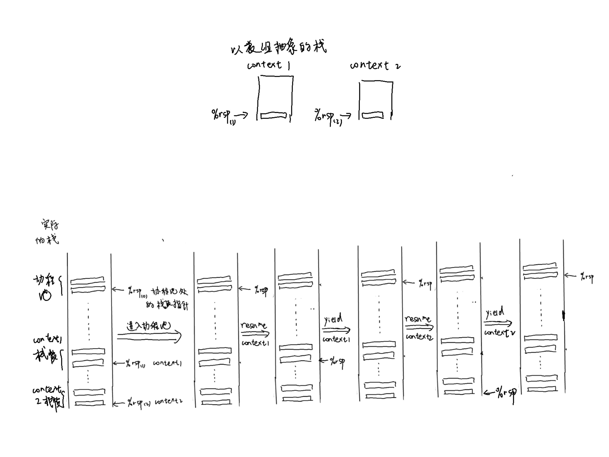
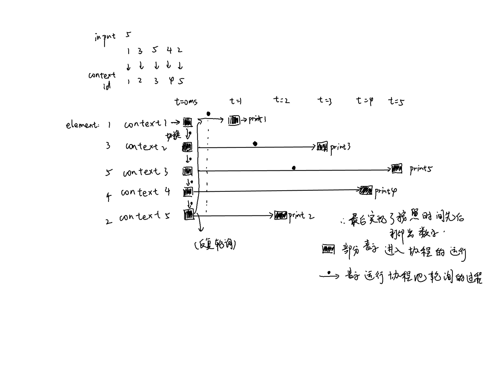

## 计算机系统概论 协程实验报告

探微分01 李文韬 2020013210

### Task1 协程库的编写

#### Step1、基本框架理解

1. coroutine_pool 

   协程池类主要是维护一个元素类型为basic_context*的指针的数组（使用了多态），这个数组中记录了各个协程。通过这个协程池，可以保存同步执行的协程函数，并且得到当前协程池在运行哪个函数的信息。

2. context类

   context表示协程，协程中维护了一个函数栈，以及这个存协程的caller和callee的寄存器的数组，函数栈是为了在切换的过程中通过切换%rsp和保存恢复寄存器来实现协程的切换。

3.  context.S

   context.S中主要是通过汇编实现上下文的切换，在context.h文件中通过extern定义外部函数，这个外部函数是通过汇编完成的

4. resume与yield

   resume是协程池进行调用，作用是恢复这个协程，返回到这个协程切换前运行到的位置。yield是由协程调用，主动放弃运行，切换回协程池的位置，让协程池调用其他协程、

#### Step2、汇编实现上下文切换

每一个协程都有caller和callee寄存器的数组。对于协程来说，caller是协程池，切换都是在协程的角度进行的，所以在从协程池到协程的切换中，保存的是caller里面的callee-save寄存器，恢复的是callee的callee-save寄存器。同样，从协程到协程池的切换中，保存的是callee里面的callee-save寄存器，恢复的是caller的callee-save寄存器.因此可以写出如下汇编代码。

```assembly
movq %rbx, 72(%rdi)
movq %rsp, 64(%rdi)
movq %rbp, 80(%rdi)
movq %r12, 88(%rdi)
movq %r13, 96(%rdi)
movq %r14, 104(%rdi)
movq %r15, 112(%rdi)
leaq .coroutine_ret(%rip), %rax
movq %rax, 120(%rdi)
movq 72(%rsi), %rbx
movq 64(%rsi), %rsp
movq 80(%rsi), %rbp
movq 88(%rsi), %r12
movq 96(%rsi), %r13
movq 104(%rsi), %r14
movq 112(%rsi), %r15
jmpq *120(%rsi)
```

其中movq指令就是在保存恢复寄存器的值，leaq指令计算出ret指令的绝对地址，存到120(%rdi)里面，便于之后的恢复与跳转（在附加内容中具体解释流程）。

#### Step3、resume与yield的实现

step2中分析，从协程池到协程的切换（resume）中，需要保存caller里面的callee-save寄存器，恢复的是callee的callee-save寄存器;从协程到协程池的切换（yield）中，保存的是callee里面的callee-save寄存器，恢复的是caller的callee-save寄存器.

```c++
//coroutine_pool.h
virtual void resume() {
    coroutine_switch(caller_registers, callee_registers);
}
//common.h
void yield() {
  if (!g_pool->is_parallel) {
    auto context = g_pool->coroutines[g_pool->context_id];
    coroutine_switch(context->callee_registers, context->caller_registers);
  }
}
```

#### Step4、调度器的实现

调度器需要实现轮询，我采用的方法是，先获取协程池中协程的总数，然后每一次轮询，都统计当前协程池未运行完毕的协程数量，如果等于0，说明可以结束调度。每一次轮询之后，如果还有协程没有运行完，就再进行一次轮询。具体实现如下。（包含了Task2的内容）

```c++
  void serial_execute_all() {
    is_parallel = false;
    g_pool = this;
    int coroutines_num = coroutines.size();
    while (coroutines_num>0)
    {
      coroutines_num = coroutines.size();
      for (int i=0;i<coroutines.size();i++){
        if(coroutines[i]->finished == false){
          // coroutine_main(coroutines[i]);
          this->context_id = i;
          if(coroutines[i]->ready==true){
            coroutines[i]->resume();
          }
          else{
            if(coroutines[i]->ready_func()==true){
              coroutines[i]->ready==true;
              coroutines[i]->resume();
            }
          }
        }
        else{
          coroutines_num--;
        }
      }
      // printf("one loop\n");//test
      // printf("remain corountine:%d\n",coroutines_num);
    }

    for (auto context : coroutines) {
      delete context;
    }
    coroutines.clear();
  }
};
```

#### 附加内容

1. 绘制栈的变化过程，此处显示sample中两个协程的切换

   

   为了更加清晰地显示，此处使用了gdb调试观察栈顶指针的变化。

   ```shell
   (gdb) b coroutine_switch
   Breakpoint 1 at 0x402a: file lib/context.S, line 14.
   (gdb) r
   Starting program: /home/liwentao/coroutine-with-stack/bin/sample 
   [Thread debugging using libthread_db enabled]
   Using host libthread_db library "/lib/x86_64-linux-gnu/libthread_db.so.1".
   
   Breakpoint 1, coroutine_switch () at lib/context.S:14
   14          movq %rbx, 72(%rdi)
   (gdb) n
   15          movq %rsp, 64(%rdi)
   (gdb) $ rsp
   Undefined command: "$".  Try "help".
   (gdb) p $rsp
   $1 = (void *) 0x7fffffffdf68
   (gdb) b context.S 30
   Function "context.S 30" not defined.
   Make breakpoint pending on future shared library load? (y or [n]) n
   (gdb) b context.S:30
   Breakpoint 2 at 0x55555555806d: file lib/context.S, line 30.
   (gdb) c
   Continuing.
   
   Breakpoint 2, coroutine_switch () at lib/context.S:30
   30          jmpq *120(%rsi)
   (gdb) p $rsp
   $2 = (void *) 0x555555574000
   ```

   可以看到，context.S里面完成了栈顶的切换，从协程池运行时候的栈顶指针切换到1号协程的栈顶（虚拟栈顶，是由协程里面所申请的数组的末尾元素地址确定的）。

2. 协程开始执行的过程

   ```c++
   // TODO: Task 1
   // 在实验报告中分析以下代码
   // 对齐到 16 字节边界
   uint64_t rsp = (uint64_t)&stack[stack_size - 1];
   rsp = rsp - (rsp & 0xF);
   
   void coroutine_main(struct basic_context * context);
   
   callee_registers[(int)Registers::RSP] = rsp;
   // 协程入口是 coroutine_entry
   callee_registers[(int)Registers::RIP] = (uint64_t)coroutine_entry;
   // 设置 r12 寄存器为 coroutine_main 的地址
   callee_registers[(int)Registers::R12] = (uint64_t)coroutine_main;
   // 设置 r13 寄存器，用于 coroutine_main 的参数
   callee_registers[(int)Registers::R13] = (uint64_t)this;
   ```

   **初始状态**

   上述代码首先初始化了一个协程。首先确定通过stack分配一个协程的栈桢，这个栈桢的栈顶是rsp（rsp - (rsp & 0xF)是为了16字节对齐）。然后将这个协程所包含的寄存器数组初始化。

   具体的：把rsp赋值给callee_registers寄存器数组的RSP对应位置（用于栈顶的切换）；把coroutine_entry的地址赋值给寄存器数组的RIP位置（为了第一次进入协程跳到coroutine_entry）位置；把coroutine_main的地址赋值给寄存器数组的R12位置（为了跳到coroutine_entry能够执行coroutine_main）；把该协程的this指针赋值给寄存器数组的的R13位置（调用coroutine_main的时候需要以协程为参数，需要保存这个协程本身）。

   **具体流程：**

   1. 开始执行

      在进行完初始化后，首次调用resume函数进入协程，此时会把协程池部分的寄存器存起来，将协程部分的寄存器恢复。这时物理寄存器中存有的rsp是协程的栈顶，r12，r13分别是coroutine_main的地址和参数，rip中存的是coroutine_entry的地址。在切换结束后，会使用jmpq *120(%rsi)指令，调用coroutine_entry函数，然后call %r12，调用coroutine_main，开始执行这个协程。

   2. 切换

      切换回协程池的时候，从之前保存的寄存器中复原寄存器，然后jump到ret指令，ret指令是读取rsp的地址让后jump到rsp。因为在函数调用的时候压入的是下一条指令的地址，所以跳转到ret指令后，可以改变rip的指向，从而返回原函数。

3. 如果需要保存浮点寄存器的值和向量寄存器的值，需要保存st0\~st7;XMM0\~XMM15，保存的方式同context.S的通用寄存器保存方式一致。

### Task2 实现sleep-sort

#### sleep函数的实现

sleep函数的具体功能是获得当前协程，把协程的ready状态置为false，然后内置一个判断是否超时的函数，由于sleep_sort中不显式调用yield，所以在sleep部分要完成切换到协程池的操作。

```c++
auto cur = get_time();
auto context = g_pool->coroutines[g_pool->context_id];
context->ready = false;
context->ready_func = [=]()->bool{return std::chrono::duration_cast<std::chrono::milliseconds>(get_time() - cur).count() > ms;};
coroutine_switch(context->callee_registers, context->caller_registers);
```

#### 调度器的完善

代码已经在第一部分展示，在这一步，主要是完善了对于协程ready属性的判断。当协程ready的时候，就恢复运行，否则调用ready_func函数，检查是否超时，等待到超时后，就可以调用resume切入。因为对于协程ready_func的查询是非常快的，所以可以在误差范围内实现排序（分时段地输出）。

#### 附加内容

1. 按照时间线，绘制出 `sleep_sort` 中不同协程的运行情况。

   

2. 考虑ready_func函数的调用

   因为在调度器层面频繁地调用ready_func函数（可能对于示例的排序要进行上百次的调用）。希望能够再调度器层面不调用函数直接判断协程是否ready。为实现这一目标，我们给协程类定义**进入时间**的公有成员变量expect_time。在调用sleep函数的时候，根据当前时间以及期待睡眠的时间设置该变量的值。在协程池中可以直接访问协程的成员变量与当前时间进行比较，从而避免频繁的ready_func函数调用。

### Task3 实现协程二分查找

#### 原理

这部分需要增加的代码不多，主要是理解其原理。因为有可能数组的size太大，没办法一次装入缓存，需要从内存中访存取得，会带来时间上的浪费。在二分查找中，我们需要频繁的取数组的中点位置。如果中点位置的元素不在缓存中，会使得程序变慢。所以在排序中，我们用__builtin_prefetch函数预取中点的元素，从而加快程序。

```c++
__builtin_prefetch(&table[probe]);
yield();
```

#### 附加内容

```
#### default setting
Size: 4294967296
Loops: 1000000
Batch size: 16
Initialization done
naive: 4233.36 ns per search, 132.29 ns per access
coroutine batched: 1736.88 ns per search, 54.28 ns per access

#### 2000000
Size: 4294967296
Loops: 2000000
Batch size: 16
Initialization done
naive: 6176.35 ns per search, 193.01 ns per access
coroutine batched: 3308.56 ns per search, 103.39 ns per access

#### 3000000
Size: 4294967296
Loops: 3000000
Batch size: 16
Initialization done
naive: 1959.61 ns per search, 61.24 ns per access
coroutine batched: 3071.21 ns per search, 95.98 ns per access

#### 3000000 again
Size: 4294967296
Loops: 3000000
Batch size: 16
Initialization done
naive: 4931.74 ns per search, 154.12 ns per access
coroutine batched: 1937.29 ns per search, 60.54 ns per access
```

可以看到在默认的超参情况下，使用协程优化的程序运行速度是naive方法的2.43倍。在调大loops的时候，我们观察到协程优化有时候效果好，有时候效果差。这样的结果是正常的，因为naive方法的缓存命中率是随机的，有时候运气好的话会比频繁的协程切换要好。

### 心得体会

第一次写汇编程序的小实验，有很多不熟悉的地方。在开始的时候，我反复看协程导读框架的PPT，反复阅读代码，花了很久的时间理解整体框架和协程的原理概念。在具体操作过程中，也遇到了很多困难，他们包括但不限于：

- 调试本地虚拟机：因为课程的服务器人数太多，赶ddl的时候连不上，所以用自己的虚拟机。因为配置可能有问题，一开始会在模板类那部分报错。经过多次尝试，最后发现需要安装了新版本的g++。

- 在写调度器的时候，一开始我直接手动调用coroutine_main函数，导致rip跳飞，程序无法运行。重新回顾PPT发现首次进入协程需要用resume调用switch进入。因此将resume写好后得以解决。

- 对于std::functional的使用不熟。我想着怎么做到不传参然后返回bool，因此在sleep里面写了条件判断然后在ready_func里面写了return true.后来经过查阅资料发现在lambda表达式的中括号加上=号可以使用局部作用域的参数，因此得以解决。

  ```c++
  context->ready_func = [=]()->bool{return std::chrono::duration_cast<std::chrono::milliseconds>(get_time() - cur).count() > ms;};
  ```

在实验中，我确实收获到了很多，理解了协程的原理，学会了如何将汇编和c++相配合实现一些相对比较底层的功能。同时，因为我平时使用vscode的时候都是习惯于用可视化界面调试，不习惯用gdb，但在这次实验中，观察寄存器的取值、栈顶指针这些需要用功能更加强大的gdb。这进一步加强了我debug的能力。

### 参考资料

协程框架导读PPT

https://blog.csdn.net/huangshanchun/article/details/47155859

Georgios Psaropoulos, Thomas Legler, Norman May, and Anastasia Ailamaki. 2017. Interleaving with coroutines: a practical approach for robust index joins. Proc. VLDB Endow. 11, 2 (October 2017), 230–242. https://doi.org/10.14778/3149193.3149202
